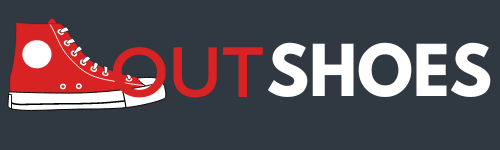

# 

###   **¿Quiénes Somos? ❓​**

Somos el equipo OutTeam, un conjunto de Desarrolladores Java FullStack Jr. con iniciativa e innovación para la creación de páginas web, colaborando en la creación de una ecommerce llamada Outshoes. 

 

###   **¿Qué es Outshoes? ❓​**
OutShoes es un proyecto de un ecommerce dedicado a la venta de calzado de las marcas más reconocidas a un menor precio, pensado en la economía y los gustos de la mayoría de familias mexicanas.

 

### **Link de nuestro repositorio de Back-end 🔙​🔚**
🌐​ <a>​https://github.com/tyronvergara/servidor-proyecto-integrador </a>
 
 

# **🏢​ Integrantes:**
 ## »👨‍💻Tyron Vergara Guerra. 
  
 
 ## »👨‍💻Héctor Arnoldo Zamora Bringas
     

 ## »👨‍💻José Gabriel Malacara Román
   

 ## »👨‍💻José Antonio Jorge Bonilla
 

 ## »👩‍💻Daniela Marlen Moreno Pérez
  

  

 # Lenguajes y Herramientas
  
 

